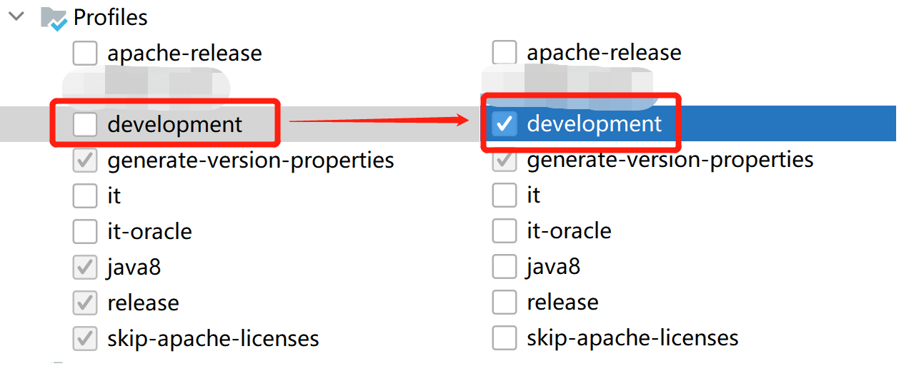

[English](./develop.md)|[中文](../zh/reference/develop.md)

# QuickSQL开发

(1)  第一步找到QuickSQL项目 https://github.com/Qihoo360/Quicksql 

（2）第二步down到本地idea

(3) 第三步本地编译及打包

（4）第四步本地运行example

(5) maven profile激活
> ps:混合查询测试
>
> 由于本地测试需要使用spark相关环境，需要激活`development`这一profile, 本质上是将hadoop, spark,
flink等组件的maven依赖scope由默认的`provided`切换为`compile`.
同样，如果需要在服务器已有spark,flink组件环境的情况下，可以打包时使用provided，QuickSQL将使用服务器环境的spark组件。

（6）第六步运行混查example

# QuickSQL JDBC规范数据源接入

目前JDBC规范的数据源接入支持YML配置接入，无需修改代码。

#### 1、配置数据源driver

pom加入driver依赖，如数据源是非开源数据库，开发时可以手动加入依赖，服务部署时可在lib下加入依赖包

#### 2、配置YML参数，文件路径：parser\src\main\resources\jdbc_source.yml

参数说明：

| 参数名          | 说明                                             | mysql示例                                                    | 是否必选 |
| --------------- | ------------------------------------------------ | ------------------------------------------------------------ | -------- |
| driver          | 连接数据源Driver全类名                           | com.mysql.jdbc.Driver                                        | 是       |
| dialect         | 数据源对应方言类名（各数据源方言列表见下方）     | MysqlSqlDialect                                              | 是       |
| showDatabaseSql | 查看当前database                                 | SELECT DATABASE()                                            | 是       |
| columnValueSql  | 查询当前表的列名，列类型，排序                   | SELECT COLUMN_NAME, DATA_TYPE, ORDINAL_POSITION FROM INFORMATION_SCHEMA.COLUMNS WHERE TABLE_NAME = '%s' AND TABLE_SCHEMA = '%s' | 是       |
| showTableSql    | 查看当前表名                                     | SHOW TABLES LIKE '%s'                                        | 是       |
| quote           | 数据源引号，当引号与方言不一致，可重置正确的引号 |                                                              | 否       |
| replaceAll      | sql替换，可替换sql中个别需替换的字段。           |                                                              | 否       |

#### 3、测试 

MetadataCollector.main() 手动加入参数，进行数据源添加。

运行server\src\test\java\com\qihoo\qsql\server\JdbcRemoteTest.java 测试类，查询刚加入的表。